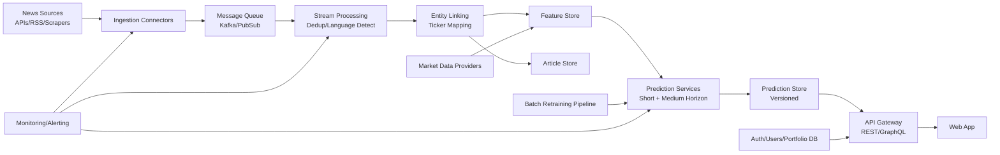

# Web-Based AI Stock Prediction Platform — Technical Plan (Draft Pending Clarifications)

## 1) Goals & Scope
- Build a global, web-based stock prediction platform that links real-time news to predicted stock price movement.
- Support tens of thousands of assets across exchanges worldwide, with a curated default universe of ~200 large-cap stocks for fast onboarding.
- Prioritize **days** and **weeks** prediction horizons while supporting hours, months, and years.

## 2) System Architecture

### Core Services
1. **Ingestion Service**: Pulls from APIs, RSS, official feeds, legal scrapers.
2. **Normalization Service**: Language detection, translation, deduplication, timestamp harmonization.
3. **Entity Linking Service**: Maps articles to companies/tickers/ETFs using NER + symbol dictionary.
4. **Feature & Sentiment Service**: Sentiment, event class, novelty, source reliability, macro tags.
5. **Prediction Service**: Multi-horizon probabilistic forecasts.
6. **Serving API**: Stock list, search, detail page data, watchlists, portfolio performance.
7. **User Service**: Accounts, auth, watchlists, portfolio entries.

## 3) Data Pipeline Design

### Ingestion
- **Streaming pull frequency**:
  - Tier-1 news APIs: every 1-2 minutes.
  - RSS/government feeds: every 2-5 minutes.
  - Batch refresh + backfill jobs: hourly.
- Use source-specific connectors with retry + idempotent offsets.

### Preprocessing
- Deduplicate (URL canonicalization + MinHash/SimHash + embedding similarity).
- Language detection and machine translation to common analysis language (English canonical text).
- Metadata enrichment: source credibility score, region, topic tags.

### Mapping Articles to Assets
- Hybrid strategy:
  - Rule-based ticker match (e.g., “AAPL”, “NASDAQ:MSFT”).
  - NER model on organization names + alias dictionary.
  - Knowledge graph linking (parent/subsidiary/ETF holdings).
- Confidence score for mapping; ambiguous articles tracked as multi-asset impact.

### Feature Creation
- NLP sentiment (document + sentence-level, finance-tuned model).
- Event extraction (earnings, M&A, lawsuit, regulation, product launch, guidance, macro shock).
- Temporal features (recency decay, story momentum).
- Market context features (volatility regime, sector beta, FX sensitivity).

### Prediction
- Multi-model ensemble producing distributions per horizon:
  - Short horizon (hours/days): gradient boosting + temporal transformer features.
  - Medium horizon (weeks/months): sequence models with macro and sector context.
- Outputs:
  - Expected % change
  - Confidence
  - Probability buckets (rise >7%, rise 3-7%, flat, fall)
- If data sufficiency threshold fails, return:
  - `0% certainty – not enough data`

## 4) Recommended News Sources / APIs

### Market & News APIs (mix free/paid)
- Finnhub, Polygon, IEX Cloud (market + company news)
- Alpha Vantage (low-cost starter data)
- NewsAPI/GDELT (broad global article flow)
- Benzinga/Refinitiv/Bloomberg (enterprise-grade, budget dependent)

### Official/Primary Sources
- SEC EDGAR (US), ESMA/EU filings, Companies House filings, exchange announcements
- Government press portals, central bank updates, regulator notices

### RSS / Publisher Feeds
- Major financial publications with licensed access
- Industry-specific publications by sector

### Legal/Scraping Notes
- Respect robots.txt, ToS, regional copyright/usage restrictions.
- Prefer licensed APIs for commercial deployment.

## 5) AI / NLP Methods
- **Sentiment model**: finance-domain transformer (FinBERT-class model) fine-tuned on market reaction labels.
- **Event classifier**: multi-label transformer + weak supervision rules.
- **Entity linker**: NER + alias dictionary + graph disambiguation.
- **Impact scoring**: combine sentiment polarity, event type prior, source reliability, novelty, recency.
- **Calibration**: isotonic/Platt scaling for probabilities by market/region/horizon.

## 6) Prediction Model Design

### Modeling Strategy
- **Ensemble**:
  - Model A: Gradient boosted trees on structured features.
  - Model B: Sequence model (Transformer/Temporal Fusion) for event timeline.
  - Model C: Baseline market factor model (sector + index + macro).
- Weighted blend via out-of-sample rolling validation.

### Horizons
- Supported: hours, days, weeks, months, years.
- Priority: days, weeks with higher update cadence and richer model capacity.

### Output Contract
For each asset + horizon:
- `expected_change_pct`
- `timeframe`
- `confidence_pct`
- `distribution` (bucket probabilities)
- `reasoning_summary` (top contributing events/features)
- `article_links[]`

## 7) Database Schema (Proposed)

### Core Data Stores
- **PostgreSQL** (relational core)
- **TimescaleDB / ClickHouse** (time-series and analytics)
- **Redis** (caching, short-lived queues)
- **Object storage** (raw article text + model artifacts)

### Key Tables
- `assets(id, ticker, name, exchange, country, sector, active, created_at)`
- `asset_aliases(asset_id, alias, source)`
- `news_articles(id, source, url, title, body, published_at, language, credibility_score, hash)`
- `article_asset_links(article_id, asset_id, link_confidence, event_type, sentiment_score)`
- `predictions(id, asset_id, horizon, expected_change_pct, confidence_pct, distribution_json, model_version, created_at)`
- `prediction_explanations(prediction_id, summary, top_features_json)`
- `price_history(asset_id, timestamp, open, high, low, close, volume)`
- `users(id, email, password_hash, created_at)`
- `watchlists(id, user_id, name)`
- `watchlist_items(watchlist_id, asset_id, added_at)`
- `portfolio_entries(id, user_id, asset_id, quantity, amount_value, amount_currency, purchase_timestamp)`
- `portfolio_performance(entry_id, valuation_timestamp, pnl_pct, pnl_value_base_ccy)`

## 8) Update Frequency Strategy
- News ingestion: every 1-5 minutes by source tier.
- Prediction refresh trigger:
  - Immediate if high-impact article detected.
  - Otherwise rolling update every 15-30 minutes.
- Full retraining:
  - Intraday light recalibration 2-4x/day.
  - Full retrain nightly/weekly depending horizon.
- Cache invalidation:
  - Per-asset cache bust on prediction write.
  - CDN short TTL for list endpoints (15-60s).

## 9) UI/UX Design (Mockup Description)

### A) Stocks Dashboard
- Table + card hybrid view.
- Columns: ticker, name, sector, country, expected change (7d default), confidence, updated time.
- Sort/filter chips: sector, country, confidence band, predicted performance.
- Live indicator + auto refresh.

### B) Search
- Typeahead for company name/ticker/partials.
- If unknown ticker:
  - “Analyze this asset” CTA.
  - Add to universe and begin pipeline evaluation.

### C) Stock Detail Page
- Header: current prediction + confidence + horizon selector.
- Probabilistic distribution chart (stacked bars/area).
- Price vs prediction trajectory chart.
- Sentiment timeline from linked articles.
- Explainability panel: top drivers, article links, event tags.

### D) Accounts
- Optional login.
- Watchlists and portfolio tabs.
- Portfolio entries support shares OR amount in any currency.
- Performance overlay vs model predictions.

## 10) Scalability Plan
- Horizontal microservices on Kubernetes/ECS.
- Queue partitioning by region/source/asset bucket.
- Separate online inference from offline training.
- Sharded storage for article corpus.
- Rate limiting + adaptive polling for external APIs.
- Start with ~200 assets, then scale to 10k+ by dynamic priority tiers.

## 11) Security, Compliance, Reliability
- OAuth2/JWT, optional MFA, password hashing (Argon2/bcrypt).
- RBAC for admin/model ops.
- Encryption at rest and in transit.
- Audit logs for model updates and data changes.
- DDoS protection and WAF.
- SLA-aware monitoring: ingestion lag, prediction freshness, API latency, model drift.
- Legal compliance: data licenses, GDPR/CCPA for user data.

## 12) Step-by-Step Implementation Roadmap

### Phase 0 (1-2 weeks): Foundations
- Finalize requirements + source licensing.
- Set up infra IaC, CI/CD, observability.

### Phase 1 (2-4 weeks): MVP Core
- Asset universe (200 default stocks).
- Ingestion from 3-5 major sources.
- Basic sentiment/event pipeline.
- Initial day/week prediction model.
- Dashboard + search + detail page.

### Phase 2 (3-6 weeks): User Features
- Accounts, watchlists, portfolio tracking.
- Improved explainability and probability distributions.

### Phase 3 (4-8 weeks): Scale & Accuracy
- Add global sources, multilingual handling.
- Model ensemble and calibration upgrades.
- Expand tracked assets aggressively.

### Phase 4 (ongoing): Production Hardening
- Cost optimization, A/B tests, drift monitoring, retraining automation.

## 13) Cost & Infrastructure Estimate (Rough)
- **Early MVP**: $1.5k-$6k/month (cloud + modest paid APIs).
- **Growth stage (10k+ assets)**: $10k-$60k+/month depending API licensing and retraining volume.
- Biggest cost drivers:
  - Premium data/news licenses
  - Compute for NLP + training
  - Storage/egress for article corpus and analytics

## 14) Limitations & Risks
- Market unpredictability and regime shifts.
- Data licensing constraints and paywalls.
- Entity linking ambiguity for multinational firms.
- Language nuances in global news sentiment.
- Risk of overfitting recent macro periods.
- Latency/cost trade-off at very high asset counts.

## 15) Clarification Questions (Required Before Finalizing)
1. **Target launch scope**: Should MVP launch with US-only + select global giants, or truly global exchanges from day one?
2. **Budget range**: What is your monthly budget for paid APIs and cloud infra at MVP?
3. **Data licensing**: Are you open to enterprise news providers (Refinitiv/Bloomberg), or should we design around lower-cost APIs initially?
4. **Prediction presentation**: Do you want a default horizon (e.g., 10-day) shown everywhere, with others selectable?
5. **Risk disclosures**: Any legal/compliance text you want displayed (e.g., “not investment advice” language and jurisdiction specifics)?
6. **User accounts**: Email/password only for MVP, or include social login (Google/Apple) from start?
7. **Portfolio base currency**: Should user P&L be normalized to a single base currency per user (e.g., USD) with FX history?
8. **On-demand unknown ticker analysis SLA**: acceptable wait time (e.g., <30 seconds initial estimate vs async notification)?
9. **Geographic constraints**: Any countries/regions to exclude due to policy, sanctions, or licensing?
10. **Model explainability depth**: Simple natural-language rationale only, or SHAP/feature contribution visualizations in v1?
11. **Mobile priority**: Desktop-first web app, or fully responsive mobile-first from MVP?
12. **Authentication optionality**: Should anonymous users have full read-only access to predictions?
13. **Historical backtesting**: Do you want a public backtest page showing model hit rate and calibration metrics?
14. **Alerting**: Should users get email/push alerts on prediction changes for watchlist assets in MVP?
15. **Hosting preference**: AWS/GCP/Azure preference or no constraint?

---
This plan is intentionally complete but **not final** until your answers to the clarification questions above are incorporated.
